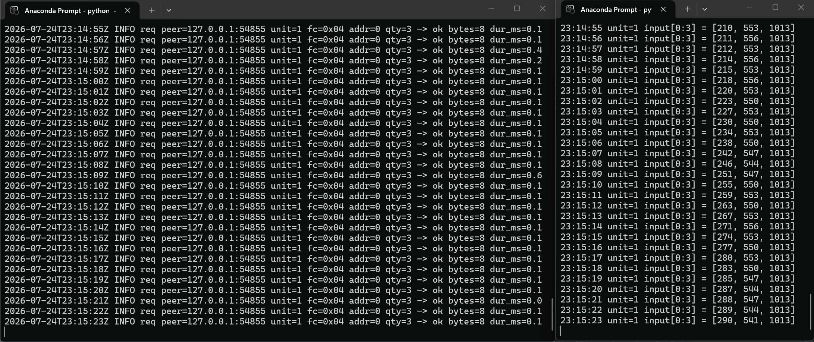

# modbus-sim

[](https://github.com/AkiyamaMio9281/modbus-sim/actions/workflows/ci.yml)


A **Modbus TCP** industrial-device simulator and client, written from scratch in pure
Python with `asyncio`. The whole protocol stack — MBAP framing, function-code dispatch,
big-endian byte handling, and TCP half-packet / sticky-packet stream reassembly — is
hand-written. No protocol library is used in the core; the industry-standard
[`pymodbus`](https://github.com/pymodbus-dev/pymodbus) appears **only** in the
interoperability test-suite, where it cross-checks our server.

> Modbus was invented in 1979 by **Modicon** — today **Schneider Electric** — and is still
> the de-facto standard fieldbus for industrial automation.

<!-- Record a 20s clip of `serve` logs next to `read-input --watch 1` and drop it here. -->


---

## Features

- **From-scratch protocol codec** (`frame.py`) — MBAP header + 8 function codes + exception
  responses, as pure `bytes ⇆ dataclass` functions with zero IO.
- **8 function codes**: read/write coils, discrete inputs, holding & input registers
  (`0x01`–`0x06`, `0x0F`, `0x10`) and all four exception codes (`01`–`04`).
- **Async multi-client server** with correct TCP stream reassembly, per-device locking,
  transaction-id echo, and structured single-line request logs.
- **YAML device maps** validated with `pydantic`, with **live data generators**
  (sine / random-walk / constant) that refresh every second so devices look alive.
- **Client CLI** for every function code, including a `--watch` polling mode.
- **Proven correct**: 200+ unit tests, Hypothesis property tests, and an 11-case
  `pymodbus` interoperability matrix, all in CI on Python 3.11 & 3.12.

## The protocol at a glance

A Modbus TCP frame (ADU) is a 7-byte **MBAP header** followed by the **PDU**:

```
 MBAP header (7 bytes, big-endian)                          PDU
┌───────────────┬───────────────┬───────────────┬────────┬───────────────────────┐
│ Transaction ID│  Protocol ID  │    Length     │Unit ID │ Function code + data   │
│    2 bytes    │  2 bytes (=0) │    2 bytes     │ 1 byte │      1..252 bytes      │
└───────────────┴───────────────┴───────────────┴────────┴───────────────────────┘
                                  └──────────────── Length counts Unit ID + PDU ───┘
```

| FC     | Name                      | Object              | Max qty |
|--------|---------------------------|---------------------|---------|
| `0x01` | Read Coils                | read/write bits     | 2000    |
| `0x02` | Read Discrete Inputs      | read-only bits      | 2000    |
| `0x03` | Read Holding Registers    | read/write 16-bit   | 125     |
| `0x04` | Read Input Registers      | read-only 16-bit    | 125     |
| `0x05` | Write Single Coil         | `0xFF00` / `0x0000` | —       |
| `0x06` | Write Single Register     | 16-bit              | —       |
| `0x0F` | Write Multiple Coils      | bits                | 1968    |
| `0x10` | Write Multiple Registers  | 16-bit              | 123     |

Exception responses set the high bit of the function code (`fc | 0x80`) and carry one code:
`01` illegal function, `02` illegal data address, `03` illegal data value,
`04` server device failure.

## Install

```powershell
conda create -n p2 python=3.11 -y
conda activate p2
pip install -e ".[dev]"      # runtime deps + pytest / hypothesis / ruff / pymodbus
```

Port **502** requires root/admin, so everything defaults to **5020**.

## Usage

### Run the simulator

```powershell
python -m modbus_sim serve --config examples/office_building.yaml
```

The example map defines three devices — a temperature/humidity sensor, a power meter, and a
variable-frequency drive — whose input registers are driven by live generators.

### Talk to it with the client CLI

```powershell
python -m modbus_sim read-holding  --unit 1 --addr 0 --count 4
python -m modbus_sim read-input    --unit 1 --addr 0 --count 3 --watch 1   # poll every second
python -m modbus_sim write-register --unit 1 --addr 0 --value 275
python -m modbus_sim write-coils    --unit 3 --addr 0 --values 1,0,1,1
```

Subcommands: `serve`, `read-coils`, `read-discrete`, `read-holding`, `read-input`,
`write-coil`, `write-register`, `write-coils`, `write-registers`. Common options:
`--host --port --unit`; reads add `--addr --count [--watch SECONDS]`.

### Define your own devices

```yaml
devices:
  - unit_id: 1
    name: temp_sensor
    holding_registers: {size: 4, init: [250, 0, 0, 0]}   # writable setpoint
    input_registers:
      size: 4
      generators:
        - {addr: 0, fn: sine,        args: {mean: 250, amp: 40, period_s: 60}}
        - {addr: 1, fn: random_walk, args: {start: 550, step: 3, min: 300, max: 800}}
        - {addr: 2, fn: constant,    args: {value: 1013}}
```

## Architecture

The core design rule: **`frame.py` and `dispatcher.py` are pure functions** (bytes /
dataclass in, bytes / dataclass out, zero IO). That keeps the wire format in one auditable
place and lets ~90% of the tests exercise the protocol without ever opening a socket.

```
modbus_sim/
├── frame.py        # MBAP + PDU encode/decode, bit/register packing   (pure)
├── datastore.py    # four register regions, bounds checks, per-device lock
├── dispatcher.py   # function-code routing + exception-code ordering  (pure)
├── generators.py   # sine / random_walk / constant value generators
├── config.py       # YAML loading + validation (pydantic)
├── server.py       # asyncio server, StreamFramer, structured logging
├── client.py       # async client, reusing the same frame codec
└── cli.py          # serve + client subcommands
```

Exception-code **priority** (`01 → 03 → 02 → 04`) is enforced by *where* each check lives:
unknown function codes fail at decode time (`01`); quantity/value checks run before any
region access (`03`); the data region raises address errors only once the quantity is
valid (`02`); anything unexpected is caught as `04`.

## Testing

```powershell
pytest -q                                   # full suite
pytest tests/test_interop.py -q             # pymodbus cross-check (11 cases)
pytest --cov=modbus_sim.frame --cov=modbus_sim.dispatcher --cov-report=term-missing
ruff format --check . ; ruff check .
```

- **Spec-vector tests** pin exact byte strings from the *Modbus Application Protocol
  Specification v1.1b3* examples, so correctness is proven against the standard.
- **Interop matrix**: all 8 function codes plus 3 exception cases round-tripped against
  `pymodbus` 3.x — the headline correctness gate.
- **Hypothesis** proves `decode(encode(req)) == req` for any valid request, and that the
  decoder/framer never crash on arbitrary bytes.
- **Protocol-core coverage ≥ 90%** is enforced in CI (currently **98%**).

### Benchmark

```powershell
python scripts/bench.py                      # 50 connections x 10 req/s x 60s
```

Measured on a developer laptop: **30 000 requests, 0 errors**, ~500 req/s, latency
**p50 5.3 ms / p90 16.1 ms / p99 31.0 ms** — a self-contained, in-process run so anyone can
reproduce it.

## License

[MIT](LICENSE).
